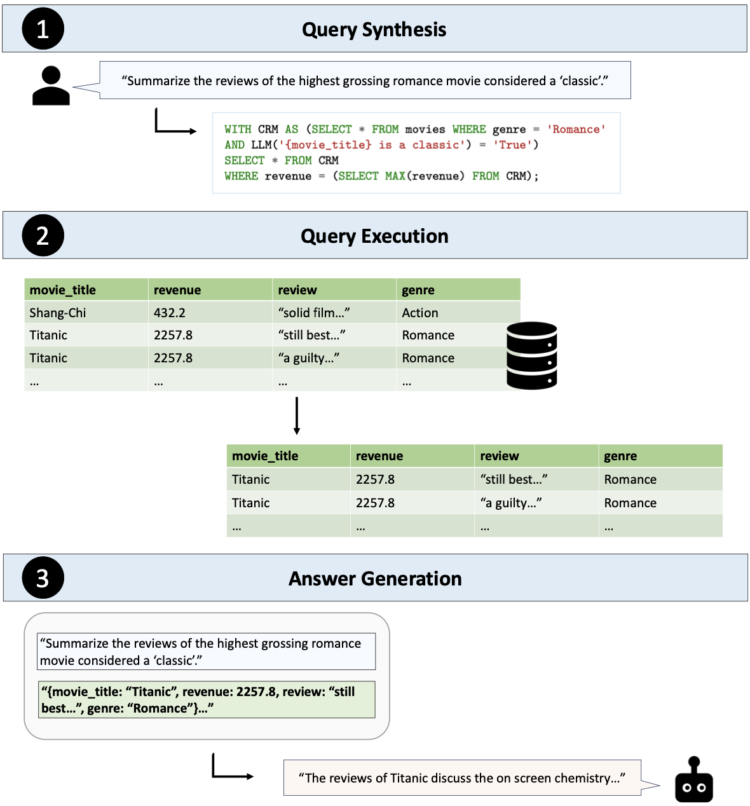

# Text2SQL is Not Enough: Unifying AI and Databases with TAG
<!--- BADGES: START --->
[][#arxiv-paper-package]
[][#license-gh-package]

[#license-gh-package]: https://lbesson.mit-license.org/
[#arxiv-paper-package]: https://arxiv.org/abs/2408.14717
<!--- BADGES: END --->

<p align="center">
  
</p>

Table-Augmented Generation (TAG) is a unified and general-purpose paradigm for answering natural language questions over databases. The TAG model represents a wide range of interactions between the LM and database that have been previously unexplored in methods such as Text2SQL and RAG. We provide the first benchmark to study the TAG problem and find that standard methods struggle to answer such queries, confirming the need for further research in this area.

# TAG v1 Benchmark
The initial TAG v1 benchmark is built upon the [BIRD](https://bird-bench.github.io) Text2SQL benchmark. To enhance the complexity of the queries and challenge the capabilities of LLMs, the queries in the TAG benchmark have been modified to require either world knowledge or semantic reasoning that goes beyond the information explicitly available in the database. We use and modify a subset of match-based, comparison, ranking, and aggregation queries from BIRD. In total, there are 80 queries, with 20 of each type. 40 of these queries require parameteric knowledge of the model and the other 40 require the model to perform reasoning.

## Setup
Here are the steps to reproduce the results in the paper.

1. Create a conda environment and download dependencies
```bash
conda create -n tag python=3.9 -y
conda activate tag
pip install -r requirements.txt
pip install -e .
```

2. Download BIRD DBs and convert them to Pandas DataFrames
```
cd setup
chmod +x get_dbs.sh
./get_dbs.sh
```

Now you should have a `dev_folder` folder that contains the databases and a `pandas_dfs` folders for the DataFrames.

3. Create indexes on each table (recommended to do with GPU)
```
cd setup
chmod +x embed_all_dfs.sh
./embed_all_dfs.sh
```

Now you should have an `indexes` folder that contains the indexes.

4. Get Text2SQL prompts
```
cd setup
chmod +x get_text2sql_prompts.sh
./get_text2sql_prompts.sh
```

This should have modified the `tag_queries.csv` file to add a Text2SQL prompt column.

## Evaluation
After performing the setup steps above, you can run the following to reproduce results in the paper. Run these in the [tag](tag) directory to get the method outputs. You should edit the `lm` object in each file to point to the language model server you want to use. Check the [LOTUS](https://github.com/stanford-futuredata/lotus) documentation for configuring models.

Hand-written TAG on [LOTUS](https://github.com/stanford-futuredata/lotus)
```
python hand_written.py \
    --pipelines 0 1 3 4 5 6 8 10 11 13 16 18 19 20 21 24 108 109 110 111 \
    25 27 29 30 33 35 36 37 38 39 40 41 42 43 44 45 46 47 48 49 \
    50 51 52 53 54 55 56 57 58 59 60 61 62 63 64 65 106 107 952 1000 \
    81 82 85 86 87 88 89 90 91 92 93 94 95 96 97 99 100 101 102 103 \
    --output_dir out_hand_written
```

Text2SQL
```
python text2sql.py --output_dir out_text2sql
```

Text2SQL + LM
```
python text2sql_lm.py --output_dir out_text2sql_lm
```

RAG
```
python rag.py --output_dir out_rag
```

Retrieval + LM Rank
```
python rag.py --output_dir out_rerank --rerank
```

Then, the accuracy and latency of each method can be evaluated via the following command
```
python analyze.py --output_dir out_hand_written
```
